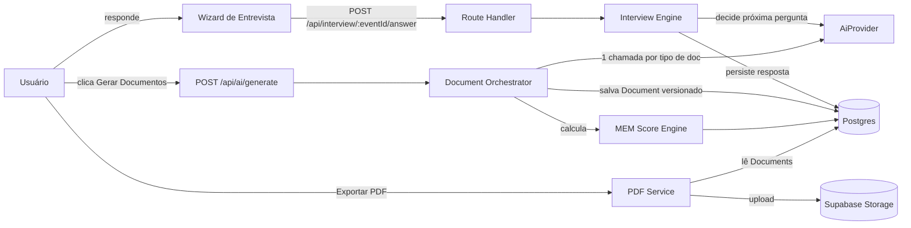

# MEM Architect — Arquitetura do MVP

> Plataforma: **MEM Architect** · Ecossistema: **MEM Technologies**
> Missão: transformar qualquer briefing de evento em um projeto profissional completo em menos de 30 minutos, usando IA como copiloto.

Este documento é a fonte de verdade da arquitetura técnica. Ele existe para que qualquer
engenheiro (humano ou agente) consiga tomar decisões consistentes sem precisar
recriar o raciocínio de novo.

## 1. Princípios que guiam toda decisão técnica

| Princípio | O que significa na prática |
|---|---|
| UX acima de funcionalidades | Nenhuma feature entra no MVP se degradar a experiência de "ligar e usar" |
| Simplicidade acima de complexidade | Um serviço (monólito modular) até haver motivo real para separar |
| IA como copiloto | A IA nunca decide sozinha; ela pergunta, analisa, propõe — o humano aprova |
| Mobile first | Todo layout é desenhado para 375px primeiro, depois expandido |
| Performance | TTFB baixo, streaming de respostas de IA, otimização de imagens |
| Escalabilidade | Stateless app layer, banco multi-tenant, filas para trabalho pesado de IA |
| Segurança | Isolamento por tenant em nível de query, secrets fora do código, RBAC |
| Modularidade | Domínios de negócio isolados em `src/modules/*`, rotas finas em `src/app` |
| API first | Toda ação do frontend passa por uma API tipada e documentada (ver `API_SPEC.md`) |
| Multi-tenant | Toda tabela de negócio carrega `organizationId`; isolamento reforçado por RLS no Postgres |
| Internacionalização preparada | Strings centralizadas, sem texto hardcoded em componentes, `next-intl` pronto para Sprint futuro |

## 2. Por que este stack

### Frontend — Next.js 14 (App Router) + React + TypeScript + Tailwind + shadcn/ui
Server Components reduzem JS no cliente (importante para mobile first e performance),
o roteamento por pastas mapeia 1:1 com os módulos de produto, e shadcn/ui dá componentes
acessíveis (Radix) sem prender a plataforma a um design system de terceiros — copiamos o
código para dentro do repo e o customizamos livremente.

### Backend — Next.js API Routes / Route Handlers (não NestJS) no MVP
**Decisão:** usar Route Handlers do próprio Next.js como backend do MVP, e não um serviço
NestJS separado.

**Justificativa:**
- Um único deploy (Vercel) elimina a necessidade de orquestrar dois serviços, dois pipelines
  de CI e duas superfícies de autenticação enquanto o produto ainda não tem tração.
- TypeScript compartilhado ponta a ponta: tipos de domínio (`src/modules/*/types.ts`) são
  importados tanto pelas rotas de API quanto pelos componentes React, sem duplicação nem
  geração de client.
- A lógica de negócio vive em `src/modules/*` (services puros, sem dependência do Next),
  então migrar para NestJS depois — se o volume de processamento de IA (filas, workers,
  webhooks) justificar um serviço dedicado — significa mover pastas, não reescrever.
- API first é mantido mesmo sem um framework de backend dedicado: cada rota segue o
  contrato documentado em `API_SPEC.md`, com schemas Zod compartilhados por request/response.

**Gatilho para migrar para NestJS:** quando surgir processamento assíncrono pesado
(filas de geração de PDF/IA em lote, webhooks de fornecedores) que precise rodar fora do
runtime serverless da Vercel — nesse ponto extraímos um serviço de workers, mantendo o
Next.js como BFF.

### Banco — PostgreSQL + Prisma
Postgres dá suporte nativo a JSONB (essencial para guardar o conteúdo dos documentos
gerados por IA, que têm forma semi-estruturada) e Row Level Security (isolamento de tenant
na camada de banco, defesa em profundidade além do filtro por `organizationId` no código).
Prisma dá migrations versionadas, tipos gerados automaticamente e um client seguro.

### Autenticação — Auth.js (NextAuth v5), não Clerk
**Justificativa:** o produto é B2B multi-tenant desde o dia 1 — cada usuário pertence a uma
ou mais Organizations com um papel (`OWNER`/`ADMIN`/`MEMBER`). Isso é modelagem de domínio
nossa, não um objeto de terceiro. Auth.js permite:
- Guardar `organizationId` e `role` ativos direto no JWT/session callback, sem depender de
  metadata proprietária de um vendor.
- Zero custo por usuário ativo (importante em early stage, antes do pricing estar validado).
- Adapter oficial para Prisma — usuários, contas e sessões vivem no mesmo Postgres do
  resto do domínio, um único lugar para backup/observabilidade.

Clerk venceria em velocidade de setup de UI (magic link, MFA prontos), mas o MVP prioriza
controle do modelo de tenancy e custo previsível sobre velocidade de setup de tela de login
— que é simples o suficiente para construirmos em um dia.

### Storage — Supabase Storage
Mesmo provedor do Postgres gerenciado reduz a superfície de infraestrutura (um único
dashboard, uma única cobrança, um único ponto de auditoria) e já resolve URLs assinadas
para os PDFs executivos gerados por evento.

### IA — OpenAI API atrás de uma interface `AiProvider`
Nenhum código de produto chama a OpenAI diretamente. Tudo passa por
`src/modules/ai/provider.ts`, uma interface mínima (`generateText`, `generateStructured`,
`streamText`) implementada por `openai-provider.ts` hoje e substituível por
Anthropic/outro provedor amanhã sem tocar em módulos de domínio (entrevista, documentos).

### Deploy — Vercel (app) + Supabase (Postgres + Storage)
Preview deployments por PR, edge network para o frontend, zero infra para gerenciar no MVP.

## 3. Visão de módulos

```
/auth          → login, sessão, convite de membros, papéis
/dashboard     → visão consolidada (eventos, pendências, MEM Score, atividades)
/events        → CRUD de eventos, ciclo de vida do projeto
/interview     → wizard conversacional que alimenta a IA
/documents     → geração, edição e versionamento dos documentos MEM
/ai            → abstração de provedor de LLM + orquestração dos agentes de geração
/templates     → biblioteca de templates reutilizáveis (perguntas, checklists, orçamentos)
/settings      → organização, membros, billing (futuro), preferências
/analytics     → MEM Score agregado, funil de eventos, uso de IA
```

Cada módulo de negócio existe fisicamente em `src/modules/<nome>` (services, schemas Zod,
tipos, regras) e é exposto por rotas finas em `src/app/(app)/<nome>` (UI) e
`src/app/api/<nome>` (API). Componentes de UI nunca acessam o Prisma diretamente — sempre
passam pela camada de serviço do módulo.

## 4. Multi-tenancy

- Toda tabela de negócio tem `organizationId` (FK obrigatória).
- Toda query de leitura/escrita passa por um helper (`withTenant(orgId)`) que injeta o
  filtro — nenhuma query "solta" sem escopo de tenant é permitida em code review.
- RLS do Postgres é a segunda camada: policies usam `current_setting('app.org_id')`,
  setado por transação a partir da sessão autenticada.
- Convites de membros geram uma `Membership` (usuário × organização × papel); um usuário
  pode pertencer a mais de uma organização (ex.: freelancer que atende múltiplas produtoras).

## 5. Fluxo de dados de ponta a ponta (visão de arquitetura)



## 6. Segurança

- Segredos apenas em variáveis de ambiente (`.env`, nunca commitado — ver `.env.example`).
- Toda rota de API valida sessão + pertencimento à organização do recurso antes de tocar
  no banco.
- Toda entrada de usuário passa por schema Zod antes de chegar à camada de serviço.
- Rate limiting nas rotas de IA (custo direto por chamada).
- Logs de geração de IA (`AiGenerationLog`) para auditoria de custo e conteúdo.

## 7. Estrutura de pastas

```
src/
  app/
    (auth)/sign-in/            # tela de login
    (app)/layout.tsx           # shell autenticado: Sidebar + Topbar
    (app)/dashboard/
    (app)/events/
    (app)/events/[eventId]/
    (app)/events/[eventId]/interview/
    (app)/design-system/       # style guide vivo dos componentes
    api/auth/[...nextauth]/
    api/events/
    api/interview/[eventId]/answer/
    layout.tsx                 # root layout
    globals.css                # tokens de design
  components/
    ui/                        # primitivas do design system (Button, Card, Badge...)
    layout/                    # Sidebar, Topbar
    dashboard/                 # widgets do dashboard
  modules/
    auth/
    events/
    interview/
    documents/
    ai/
  lib/
    db.ts                      # Prisma client singleton
    auth.ts                    # config do Auth.js
    utils.ts
prisma/
  schema.prisma
docs/
  ARCHITECTURE.md   DATABASE.md   USER_FLOWS.md   WIREFRAMES.md
  DESIGN_SYSTEM.md  ROADMAP.md    BACKLOG.md      API_SPEC.md
```

Ver `DATABASE.md` para o modelo de dados completo e `ROADMAP.md` para a sequência de
implementação por sprints.
