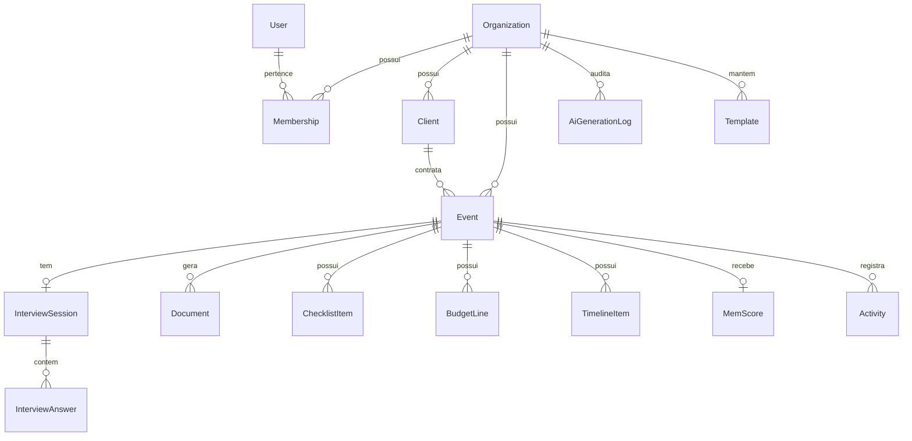

# MEM Architect — Modelagem de Banco de Dados

Fonte executável: `prisma/schema.prisma`. Este documento explica o *porquê* de cada
entidade e como elas se relacionam.

## Diagrama de entidades

## Entidades

### Organization (tenant)
A unidade de isolamento de dados. Toda entidade de negócio referencia `organizationId`.
Representa a produtora/empresa de eventos que assina o MEM Architect.

### User / Membership
`User` é a identidade (login). `Membership` é o vínculo N:N entre `User` e `Organization`
com um `role` (`OWNER`, `ADMIN`, `MEMBER`). Isso permite que um freelancer atenda mais de
uma produtora com o mesmo login, e que uma organização tenha múltiplos usuários com
permissões diferentes — necessário desde o MVP porque "Usuários" e "Configurações" já são
módulos do produto.

### Client
O cliente final da produtora (quem contrata o evento). Não é um usuário do sistema — é um
registro de CRM simples usado para preencher a entrevista e o resumo executivo.

### Event
O agregado central do produto. Guarda tipo, objetivo, data, local, orçamento alvo,
status (`DRAFT → INTERVIEW → GENERATING → REVIEW → READY → ARCHIVED`) e é o pai de tudo
que a IA gera.

### InterviewSession / InterviewAnswer
A entrevista é modelada como uma sessão com uma lista ordenada de respostas, não como um
formulário fixo. Cada `InterviewAnswer` guarda `questionKey`, `questionText` (a pergunta
efetivamente exibida, já que ela é dinâmica) e `answerValue` (JSON, pois o tipo de resposta
varia: texto, número, seleção, multi-seleção). Isso é o que permite ao motor de entrevista
decidir a próxima pergunta com base nas anteriores sem precisar de uma tabela por pergunta.

### Document
Um documento gerado (`DNA_EVENTO`, `MAPA_EMOCAO`, `JORNADA_MEMORAVEL`, `LINHA_DO_TEMPO`,
`PLANO_OPERACIONAL`, `CHECKLIST`, `PLANO_FINANCEIRO`, `PLANO_B`, `MEM_SCORE`,
`RESUMO_EXECUTIVO`). Guardado como `content: Json` + `version: Int` porque cada tipo de
documento tem uma forma diferente e evolui de forma independente; versionar em vez de
sobrescrever permite "desfazer" uma regeneração por IA. `ChecklistItem`, `BudgetLine` e
`TimelineItem` existem como tabelas relacionais **além** do `Document` JSON correspondente
porque essas três precisam ser editadas item a item na UI (marcar concluído, reordenar,
editar valor) — o JSON no `Document` é o snapshot "gerado pela IA", as tabelas relacionais
são o estado "editável pelo usuário" depois da geração.

### MemScore
Nota consolidada do evento (0–100) com `breakdown: Json` (ex.: completude do briefing,
aderência ao orçamento, riscos identificados). Separado de `Document` porque é recalculado
com frequência (toda edição relevante) e é lido pelo Dashboard de forma agregada — não
faz sentido tratá-lo como "mais um documento".

### Activity
Feed de auditoria/atividade recente por evento e por organização, usado no widget
"Atividades recentes" do dashboard.

### Template
Perguntas, checklists e estruturas de orçamento reutilizáveis — o conteúdo do módulo
`/templates` ("Biblioteca"). Pode ser global (seed da plataforma) ou da organização.

### AiGenerationLog
Toda chamada a um provedor de IA é logada (módulo, prompt resumido, tokens, custo estimado,
provider). Necessário para o módulo `/analytics` e para controle de custo desde o dia 1.

### Invitation
Convite de membro por e-mail (Sprint 2). Sem infraestrutura de envio de e-mail no MVP: se o
e-mail convidado já pertence a um `User`, a `Membership` é criada na hora; caso contrário o
convite fica `PENDING` e é resolvido automaticamente quando esse e-mail se cadastra (ver
`src/modules/auth/service.ts`). Existe como tabela separada de `Membership` porque um convite
pode nunca ser aceito — não faz sentido modelar isso como uma Membership "incompleta".

## Row Level Security — validado

As policies de `prisma/rls.sql` foram testadas manualmente: com uma role de banco que **não**
é dona das tabelas (cenário de produção — a role de deploy/migração nunca deve ser a mesma
usada pela aplicação), uma query em `clients` sem `app.org_id` setado retorna 0 linhas, e com
`app.org_id` setado retorna exclusivamente as linhas da organização correspondente. O dono da
tabela (ex.: `postgres`, usado localmente para migrar) ignora RLS por padrão — isso é
comportamento nativo do Postgres, não uma falha das policies, e é o motivo de `rls.sql`
insistir para a aplicação nunca se conectar com a role de migração.

## Decisões de modelagem

- **JSONB para conteúdo gerado por IA, tabelas relacionais para o que o usuário edita
  linha a linha.** Evita tanto o extremo de "tudo em JSON" (impossível de consultar/editar
  granularmente) quanto o de "tudo normalizado" (rígido demais para conteúdo que muda de
  forma entre versões de prompt).
- **Enums no Prisma para tudo que é um conjunto fechado de estados** (`EventStatus`,
  `DocumentType`, `Role`) — migrations tornam essas mudanças explícitas e revisáveis.
- **Sem soft-delete no MVP** além de `Event.status = ARCHIVED`; simplicidade acima de
  complexidade até haver requisito real de retenção/compliance.
- **Isolamento de tenant reforçado em duas camadas**: filtro obrigatório por
  `organizationId` na camada de serviço + Row Level Security no Postgres como defesa em
  profundidade (ver `ARCHITECTURE.md` §4).

Ver `prisma/schema.prisma` para os campos completos, índices e relações.
