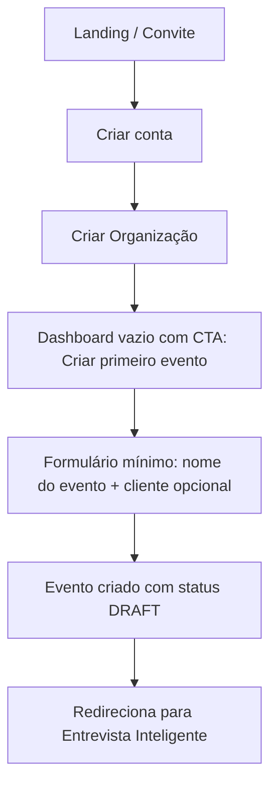
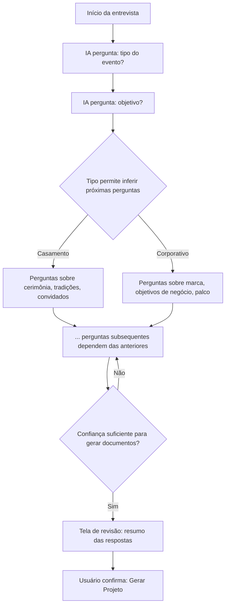
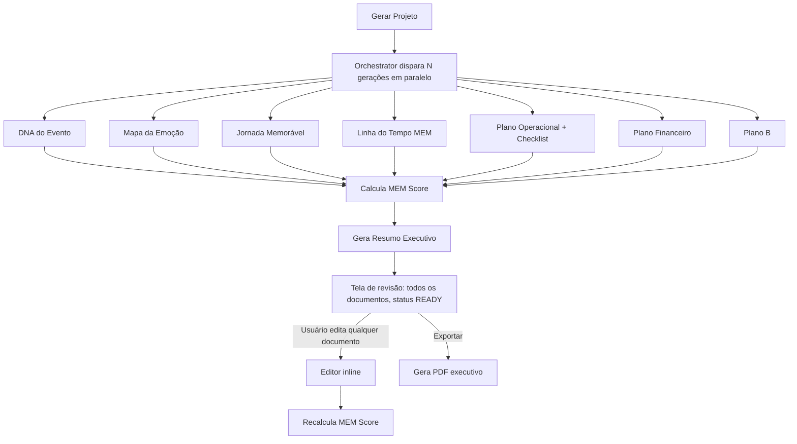
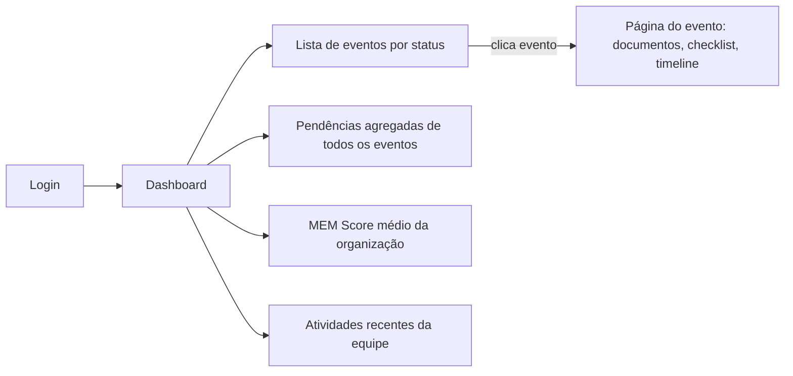
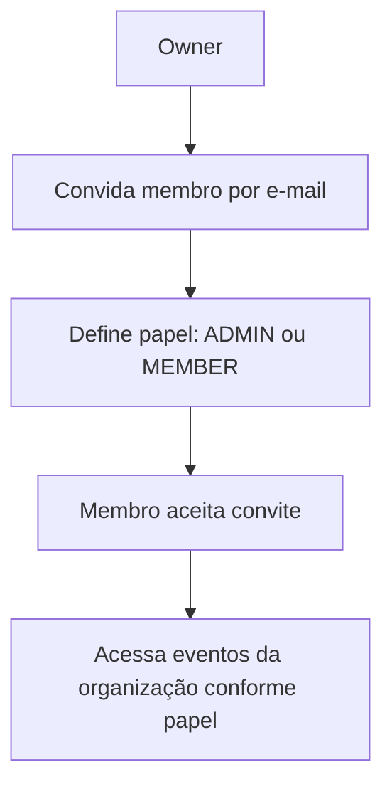

# MEM Architect — Fluxos de Usuário

## Fluxo 1 — Onboarding e primeiro evento

## Fluxo 2 — Entrevista Inteligente (o coração do produto)

Regras de UX:
- Nunca mais de **uma pergunta por tela** (mobile first, sem formulário longo).
- Cada resposta é salva imediatamente (sem botão "salvar"); o usuário pode sair e voltar.
- Uma barra de progresso indica "estimativa", não porcentagem exata (o número de perguntas
  é dinâmico).
- O usuário pode sempre voltar e editar uma resposta anterior; isso invalida (não deleta)
  perguntas subsequentes que dependiam dela, e o motor re-pergunta o que for necessário.

## Fluxo 3 — Geração de documentos

Enquanto os documentos são gerados, a UI mostra estado de progresso por documento
(pendente → gerando → pronto), nunca uma tela de loading bloqueante única — o usuário pode
começar a revisar o DNA do Evento enquanto o Plano Financeiro ainda está sendo gerado.

## Fluxo 4 — Uso recorrente (dashboard)

## Fluxo 5 — Colaboração (multi-usuário)

